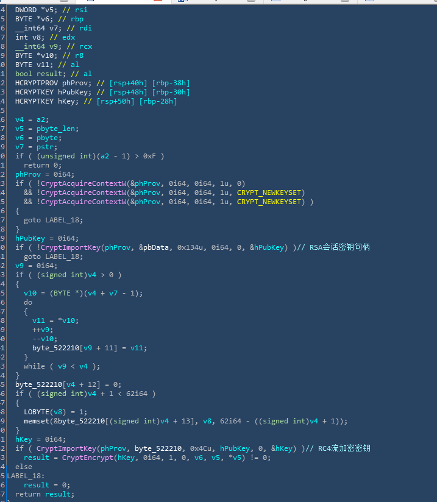
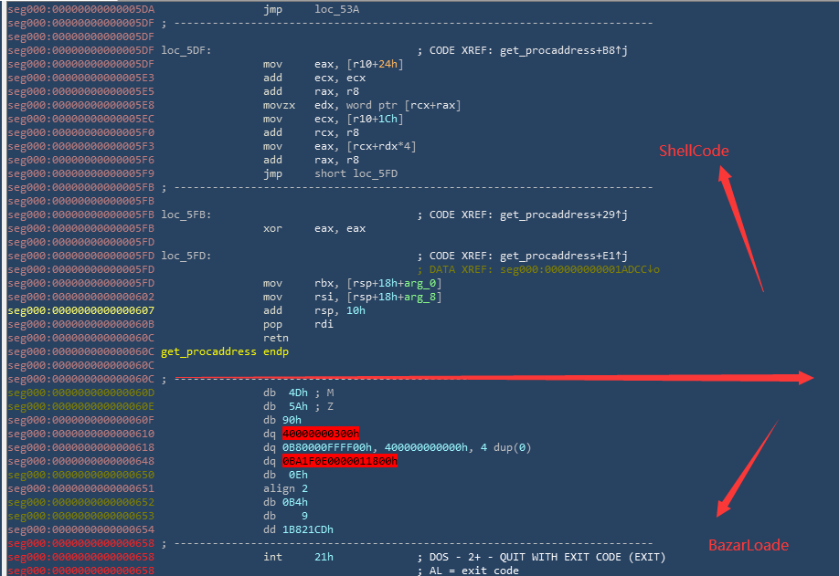
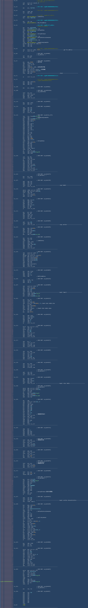
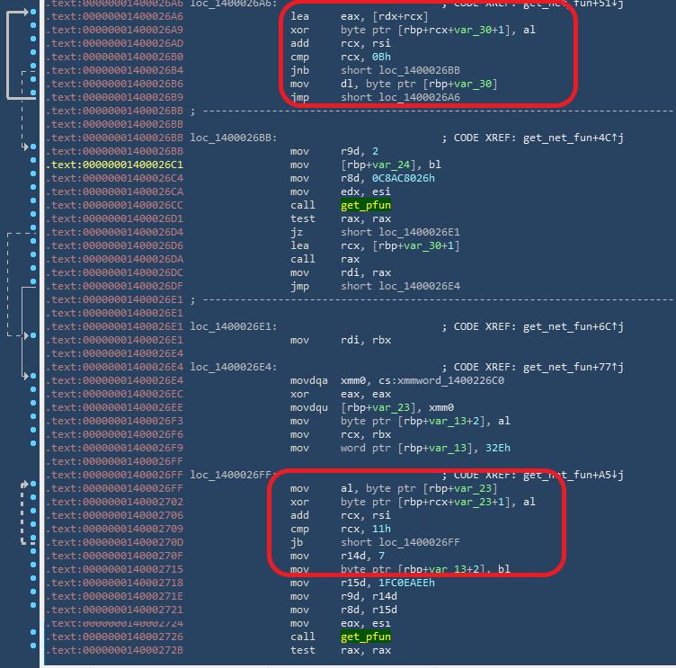

## 背景介绍
BazarLoader主要通过解析以.bazar为结尾的域名来和服务器进行通讯，从而获取病毒的核心文件BazarBackdoor，其目的在于隐藏自身，隐蔽加载核心病毒文件，而BazarBackdoor则用来执行二进制文件，脚本和其他模块，结束进程并移除自身。
## 代码解密
#### 函数原型
#### bool __fastcall decode_shellcode(__int64 pstr, int a2, BYTE *pbyte, DWORD *pbyte_len)
#### 参数一：密钥填充的串
#### 参数二：用来取串的下标和填充限制
#### 参数三：用来加密的字节（从函数CryptEncrypt解释来看是加密用的）
#### 参数四：要加密的字节长度

#### 通过加密之后的字节码包括两个部分：
#### shellcode：fileless code 也就是无文件加载代码
#### PE文件:loader主程序，在内存进行展开之后进行服务器通讯

## 无文件加载
获取必要的函数》》做一些检查（运行平台，区段数量，对其字节数）》》拷贝头部》》拷贝区段》》修复导入表》》修复重定位》》设置区段属性（读，写，执行）》》跳转到入口点执行

## 请求函数
最终loader的主程序执行也十分的隐蔽，关键函数的字符串全被加密，加密原理大致是跨字节的亦或加密，其解密函数如下形式：

解密一系列网络函数用于服务器的请求
