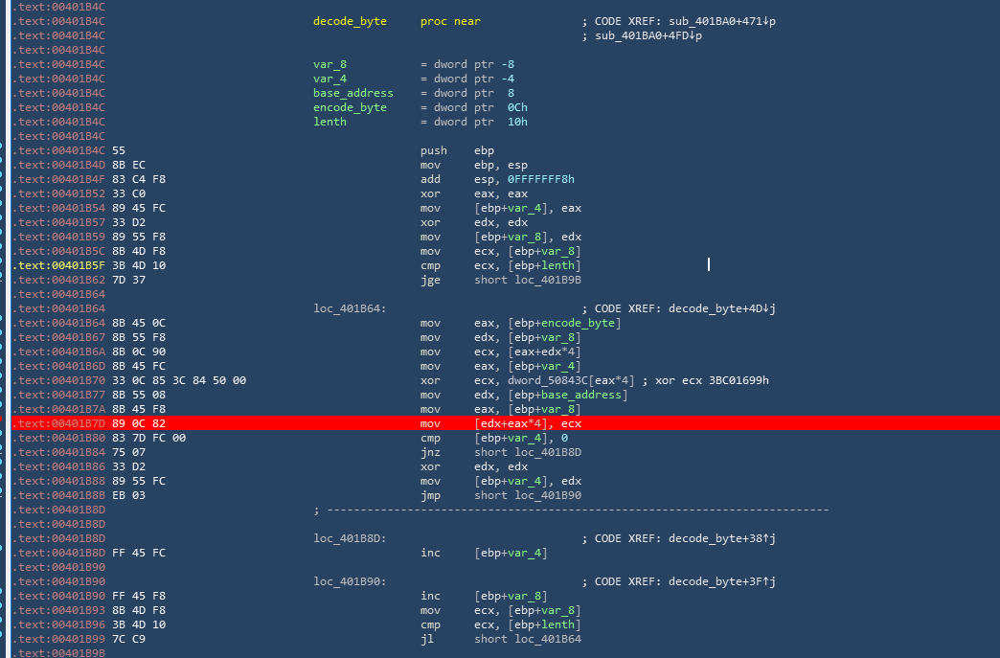
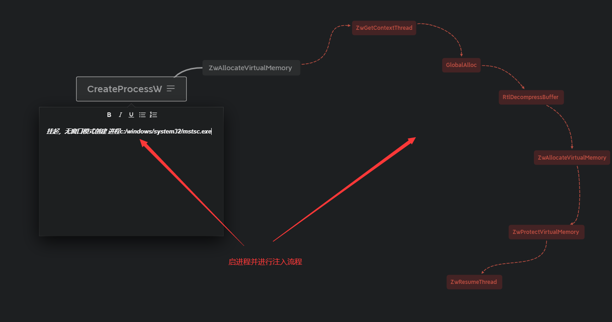
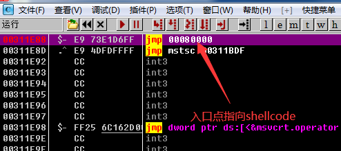
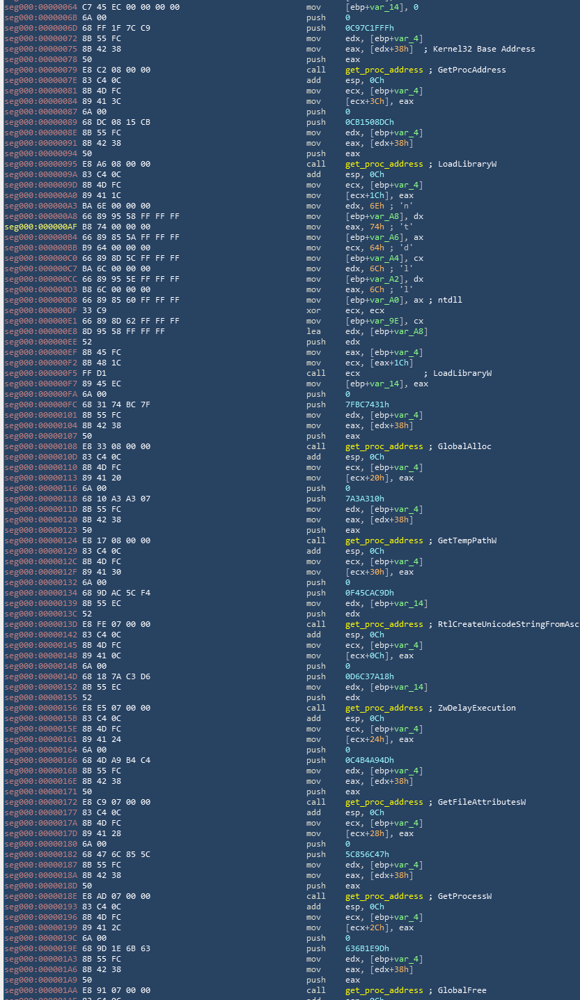
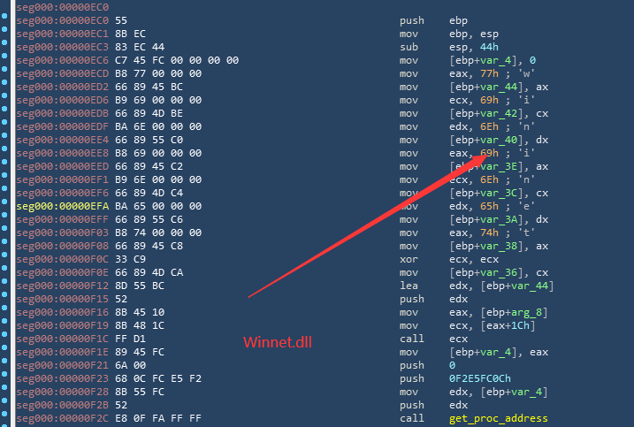

# 背景
Parallax后门于2019年出现在地下社区，由于其使用的是MASM编写所以具有较低的检测率，另外其本身带有签名辅助其顺利躲过一些安全软件的查杀。作者使用了进程真空注入技术来执行payload，在本次的样本中对系统进程 mstcs.exe进行注入。

# 技术分析
## shellcode/string 解密
### 解密函数
```
函数名：decode_byte
参数一：base_address
参数二：encode_byte
参数三：length
```


### 解密原理
将加密字节按照四字节为单位与固定的整数进行亦或，伪代码如下：

```
int __cdecl decode_byte(int a1, int a2, int a3)
{
  int result; // eax
  int i; // [esp+0h] [ebp-8h]
  int v5; // [esp+4h] [ebp-4h]

  result = 0;
  v5 = 0;
  for ( i = 0; i < a3; ++i )
  {
    result = i;
    *(_DWORD *)(a1 + 4 * i) = 3BC01699h ^ *(_DWORD *)(a2 + 4 * i);
    if ( v5 )
      ++v5;
    else
      v5 = 0;
  }
  return result;
}
```

## 进程注入


主进程首先以挂起和无窗口的方式创建进程mstcss.exe，随后使用zw*系列函数将解密之后的shellcode以及下载图片的地址注入到mstcss.exe。


## ShellCode执行
### shellcode使用PEB获取模块基址+计算模块导出函数的HASH+HASH匹配获取重要函数LoadLibraryW+GetProcAddress，结合这两个函数进行其他模块函数的调用。

### HASH伪代码
```
函数名：get_hash
参数一：函数名字符串指针
int __cdecl get_hash(int a1)
{
  signed int i; // [esp+0h] [ebp-10h]
  int v3; // [esp+4h] [ebp-Ch]
  int v4; // [esp+8h] [ebp-8h]
  int v5; // [esp+Ch] [ebp-4h]

  v3 = 0;
  v5 = -1;
  while ( *(_BYTE *)(v3 + a1) )
  {
    v4 = hash_algorithm(*(unsigned __int8 *)(v3 + a1));
    for ( i = 0; i <= 7; ++i )
    {
      if ( (v4 ^ v5) >= 0 )
        v5 *= 2;
      else
        v5 = 2 * v5 ^ 0x4C11DB7;
      v4 *= 2;
    }
    ++v3;
  }
  return hash_algorithm(~v5);
}


函数名：hash_algorithm
参数一：函数名字节码
int __cdecl hash_algorithm(unsigned int a1)
{
  unsigned int v2; // [esp+8h] [ebp+8h]
  unsigned int v3; // [esp+8h] [ebp+8h]
  unsigned int v4; // [esp+8h] [ebp+8h]

  v2 = (a1 >> 1) & 0x55555555 | 2 * (a1 & 0x55555555);
  v3 = (v2 >> 2) & 0x33333333 | 4 * (v2 & 0x33333333);
  v4 = (v3 >> 4) & 0xF0F0F0F | 16 * (v3 & 0xF0F0F0F);
  return (v4 >> 24) | (v4 >> 8) & 0xFF00 | ((unsigned __int16)(v4 & 0xFF00) << 8) | (v4 << 24);
}

```
### 图片下载
通过使用函数rand/srand生成随机数和png以及TMEP目录进行拼接得到完整的图片路径，之后调用函数get_proc_address获取一系列的网络下载函数。


## 附录
```
HASH:829fce14ac8b9ad293076c16a1750502c6b303123c9bd0fb17c1772330577d65
```
