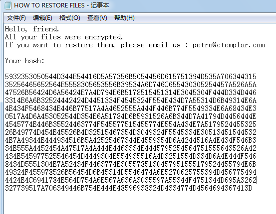
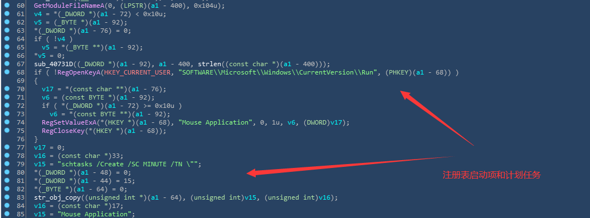
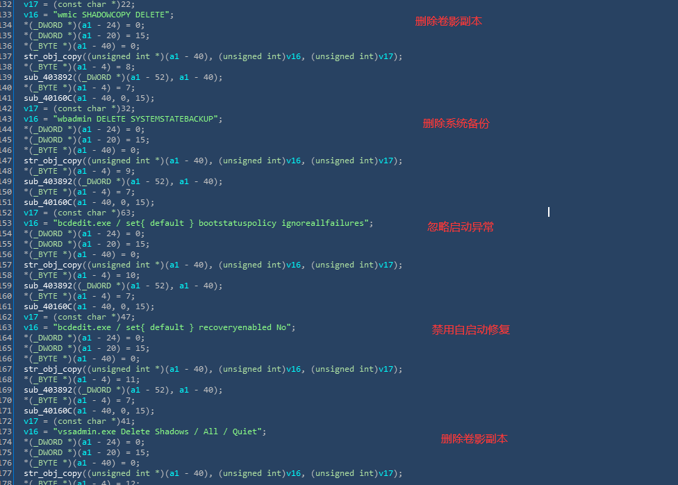
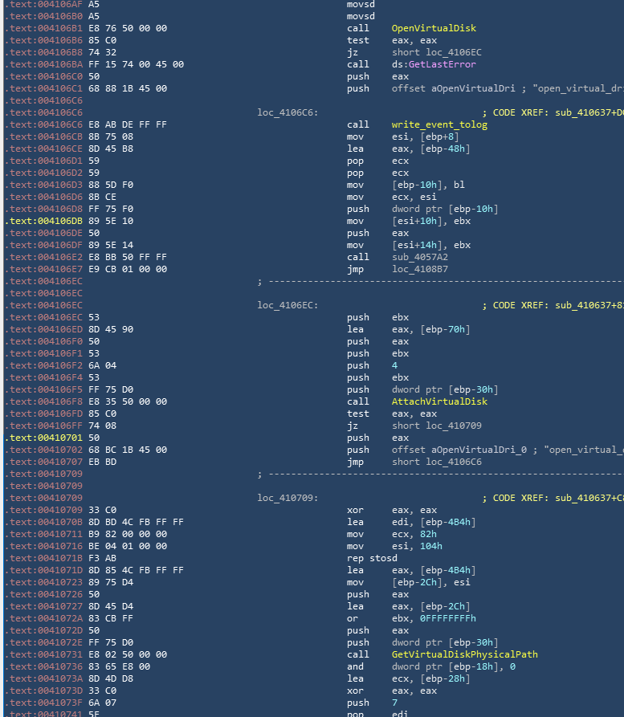
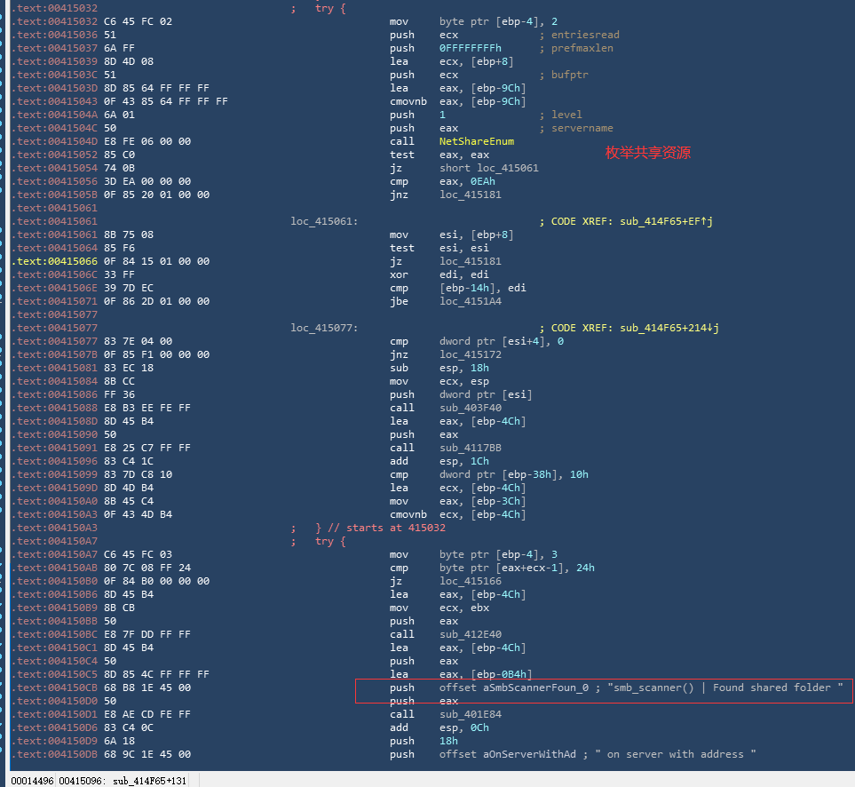
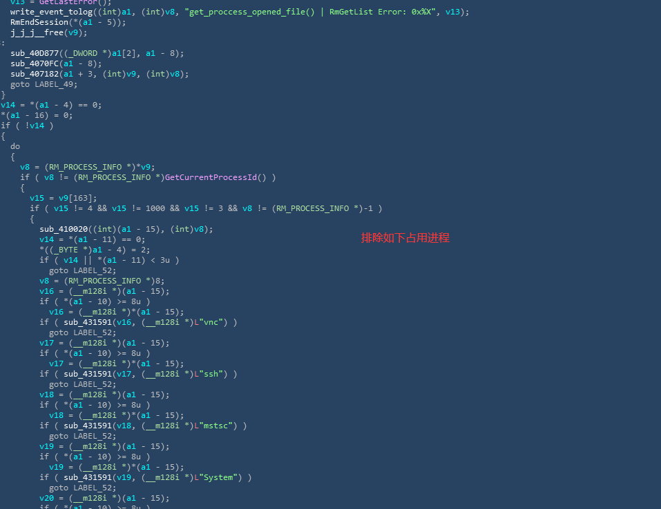
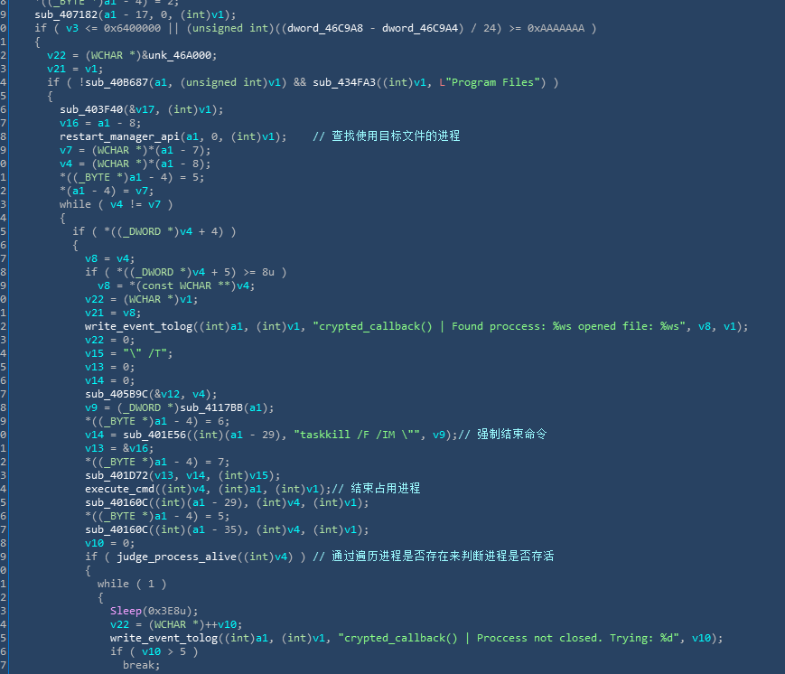

### 概览
RegretLocker是一个勒索软件，被加密之后的文件后缀位.mouse，且在病毒运行目录下会生成一个log文件，其中记录了病毒运行过程中的函数调用及其运行结果。待目标文件加密完成之后，会生成勒索信，并告知受害者独有的hash和联系地址。


### 持久性



### 不留余地




### 感染性
#### 虚拟磁盘
通过查找.vhd（虚拟磁盘）文件随后调用windows api附加并获取其真实物理设备路径。



#### SMB扫描
通过枚举扫描网段内的每个ip地址，获取其是否开启共享文件。 


### 其他
### 利用重启管理器相关API判断目标文件是否被进程占用
```
RmStartSession 启动新会话
RmRegisterResources 将目标文件注册
RmGetList  获取进程占用列表
RmEndSession 结束会话
```

### 利用命令行结束进程
